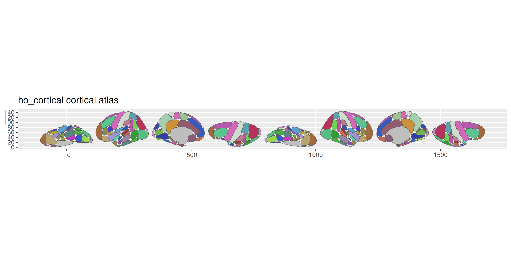
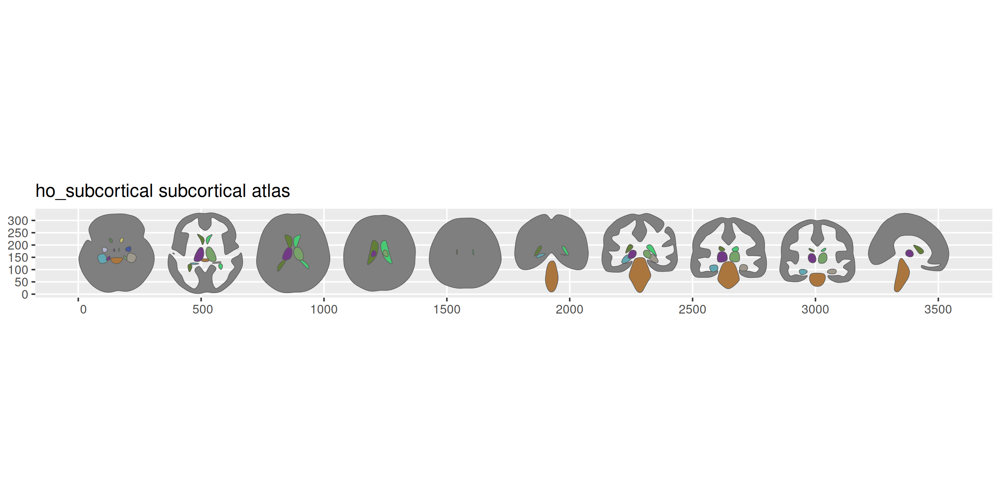
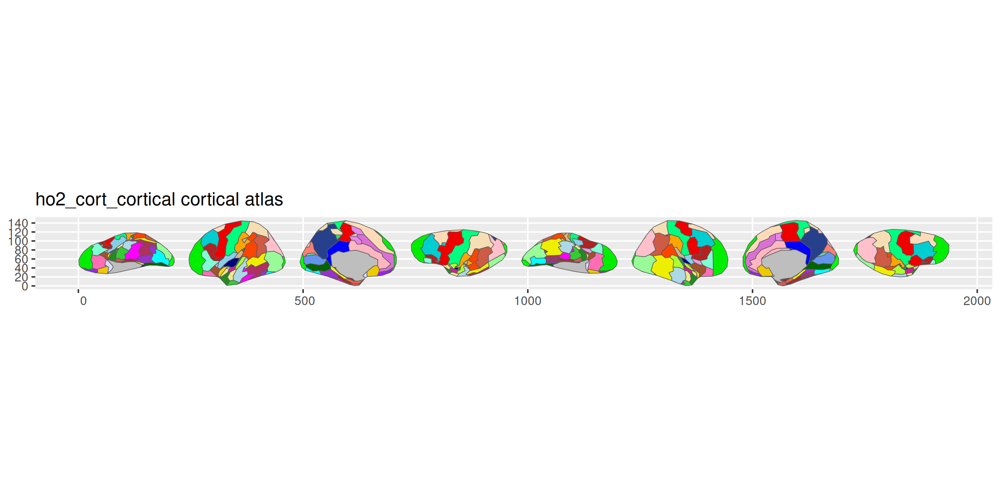
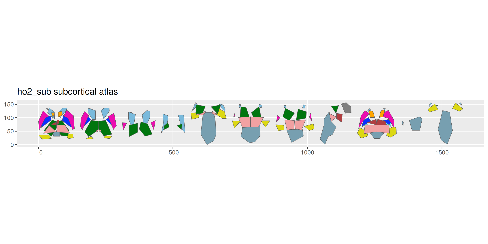
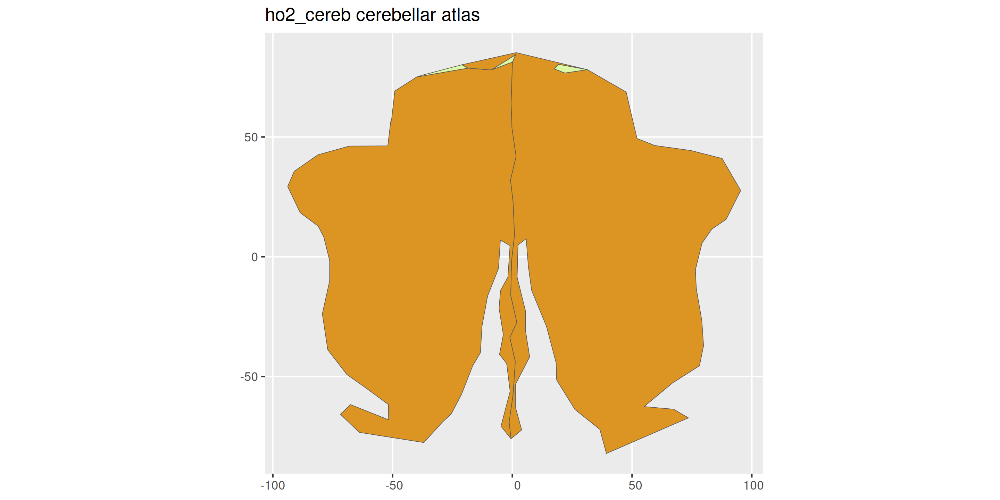

<!-- README.md is generated from README.qmd. Please edit that file -->

# ggsegHO 

<!-- badges: start -->

[](https://github.com/ggsegverse/ggsegHO/actions/workflows/R-CMD-check.yaml)
[](https://ggseg.r-universe.dev/ggsegHO)
<!-- badges: end -->

Harvard-Oxford cortical, subcortical, and cerebellar atlases for the
ggseg ecosystem. Includes the original Harvard-Oxford atlas (FSL) and
the Harvard-Oxford Atlas 2.0 (HOA-2).

## Installation

We recommend installing the ggseg-atlases through the ggseg
[r-universe](https://ggseg.r-universe.dev/ui#builds):

``` r
options(repos = c(
  ggseg = "https://ggseg.r-universe.dev",
  CRAN = "https://cloud.r-project.org"
))

install.packages("ggsegHO")
```

You can install this package from [GitHub](https://github.com/) with:

``` r
# install.packages("pak")
pak::pak("ggsegverse/ggsegHO")
```

## Harvard-Oxford cortical

``` r
library(ggseg)
library(ggsegHO)

plot(hoCort())
```



## Harvard-Oxford subcortical

``` r
plot(hoSub())
```



## HOA-2 cortical

``` r
plot(ho2_cort())
```



## HOA-2 subcortical

``` r
plot(ho2_sub())
```



## HOA-2 cerebellar

``` r
plot(ho2_cereb())
```



## Data source

Makris N, et al. (2006). Decreased volume of left and total anterior
insular lobule in schizophrenia. *Schizophrenia Research*,
83(2-3):155-171.
[doi:10.1016/j.schres.2005.11.020](https://doi.org/10.1016/j.schres.2005.11.020)

Rushmore RJ, et al. (2022). HOA2.0-ComPaRe: A next generation
Harvard-Oxford Atlas. *Frontiers in Neuroanatomy*, 16:1035420.
