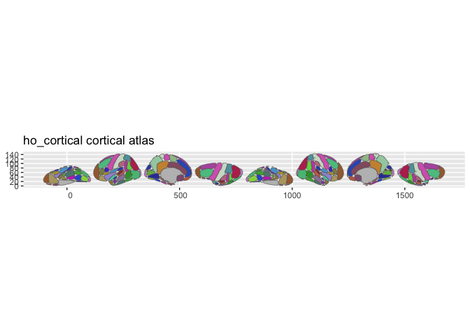
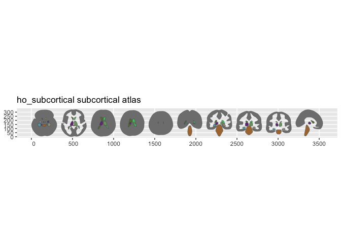

<!-- README.md is generated from README.Rmd. Please edit that file -->

# ggsegHO

<!-- badges: start -->

[](https://github.com/ggsegverse/ggsegHO/actions/workflows/R-CMD-check.yaml)
[](https://ggsegverse.r-universe.dev/ggsegHO)
<!-- badges: end -->

Harvard-Oxford Atlas for the ggsegverse Ecosystem.

## Installation

``` r
# From r-universe
install.packages("ggsegHO", repos = "https://ggsegverse.r-universe.dev")

# From GitHub
# install.packages("remotes")
remotes::install_github("ggsegverse/ggsegHO")
```

## Atlases

### hoCort

Harvard-Oxford cortical parcellation.

``` r
library(ggsegHO)
plot(hoCort())
```



### hoSub

Harvard-Oxford subcortical parcellation.

``` r
plot(hoSub())
```

 \##
Data source

Harvard-Oxford atlas from FSL, remapped to cortical/subcortical.

- **Date obtained**: 2026-02-21
