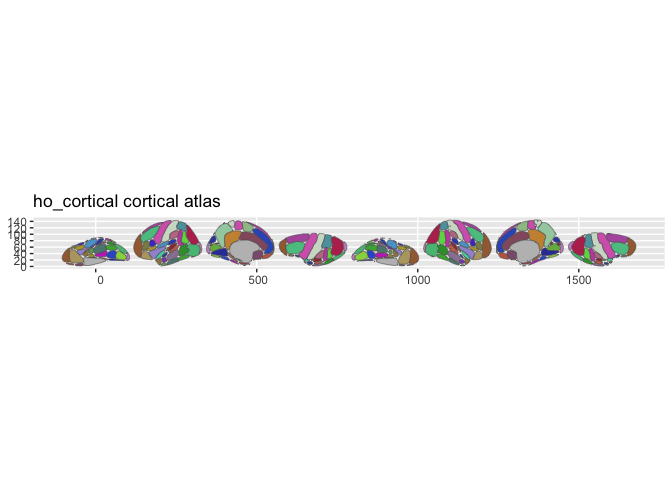

# ggsegHO

Harvard-Oxford Atlas for the ggsegverse Ecosystem.

## Installation

``` r
# From r-universe
install.packages("ggsegHO", repos = "https://ggsegverse.r-universe.dev")

# From GitHub
# install.packages("remotes")
remotes::install_github("ggsegverse/ggsegHO")
```

## Atlases

### hoCort

Harvard-Oxford cortical parcellation.

``` r
library(ggsegHO)
plot(hoCort())
```



### hoSub

Harvard-Oxford subcortical parcellation.

``` r
plot(hoSub())
```

 \## Data source

Harvard-Oxford atlas from FSL, remapped to cortical/subcortical.

- **Date obtained**: 2026-02-21
